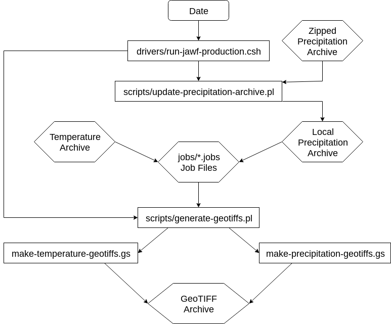

# jawf-geotiff-generator

README
===============

- **App Owner: [Adam Allgood](mailto:adam.allgood@noaa.gov)**
- **CPC Operational Backup: [David Miskus](mailto:david.miskus@noaa.gov)**

Table of Contents
-----------------

- [Overview](#overview)
- [Other Documents](#other-documents)
- [Global Variables Used](#global-variables-used)
- [Input Data](#input-data)
- [Output Data](#output-data)
- [Process Flow](#process-flow)
- [NOAA Disclaimer](#noaa-disclaimer)

Overview
---------------

This application summarizes daily gridded precipitation and temperature data created and maintained by the Climate Prediction Center for 1-day, 7-day, monthly, seasonal, and annual periods, and produces GeoTIFF products intended for use by the [Joint Agricultural Weather Facility (JAWF)](https://www.usda.gov/oce/weather). JAWF is a partnership between the National Weather Service's [Climate Prediction Center (CPC)](https://www.cpc.ncep.noaa.gov) and the United States Department of Agriculture's World Agricultural Outlook Board (WAOB).

To monitor international weather and climate conditions and generate content for the [Weekly Weather and Crop Bulletin](https://www.usda.gov/oce/weather/pubs/Weekly/Wwcb/index.htm) publication, JAWF meteorologists utilize daily, weekly, monthly, seasonal, and annual summaries of precipitation (accumulated, anomalous, and percent of normal) and temperature (mean, departure from normal, extreme maximum, extreme minimum). The `jawf-geotiff-generator` application creates these summaries from the daily data available at CPC, and provides output data in 0.25-degree GeoTIFF format with longitudes ranging from -180 to 180, in order to facilitate working with these data in GIS.

CPC maintains Python-based applications that utilize ArcGIS to create graphical products for the WWCB based on these GeoTIFF data. Additionally, the GeoTIFFs themselves are available for use by CPC and USDA meteorologists.

Other Documents
---------------

| Document Link   | Description     |
| --------------- | --------------- |
| [How to Install](docs/HOW-TO-INSTALL.md)        | How to install `jawf-geotiff-generator` in a Linux environment |
| [How to Run](docs/HOW-TO-RUN.md)                | An overview of how the application works, with a description of each component |
| [Contributing Guidelines](docs/CONTRIBUTING.md) | How to help improve this software! |
| [Software License](LICENSE)                     | Department of Commerce Software License |

Global Variables Used
---------------

The following global environment variables are utilized by `jawf-geotiff-generator`:

- `$REALTIME_ONI` - The app location on your system
- `$DATA_IN` - Root path to input data partition
- `$DATA_OUT` - Root path to output data partition

Input Data
---------------

Note: `${YYYY}` is the year, `${MM}` is the month number (01 = January, 02 = February, ..., 12 = December), and `${DD}` is the day of the month for which the daily data are valid.

### CPC Gauge-Satellite Merged Daily Precipitation Grids

**Internal Location:** `/cpc/prcp/PRODUCTS/CMORPH_V0.x/BLD/0.25deg-DLY_EOD/GLB/${YYYY}/${YYYY}${MM}/CMORPH_V0.x_BLD_0.25deg-DLY_EOD_${YYYY}${MM}${DD}.gz`

**Public Location:** [http://ftp.cpc.ncep.noaa.gov/precip/CMORPH_RT/BLD/](http://ftp.cpc.ncep.noaa.gov/precip/CMORPH_RT/BLD/)

This [GrADS data descriptor file (ctl)](http://cola.gmu.edu/grads/gadoc/descriptorfile.html) describes the dimensions of the dataset (and is available for download [here)](http://ftp.cpc.ncep.noaa.gov/precip/CMORPH_RT/BLD/CTL/CMORPH_V0.x_BLD_0.25deg-DLY_EOD.ctl):

```
DSET ^../%y4/%y4%m2/CMORPH_V0.x_BLD_0.25deg-DLY_EOD_%y4%m2%d2
OPTIONS template little_endian
UNDEF -999.0
TITLE Gauge - CMORPH_Adj Blended Analysis
XDEF 1440 LINEAR   0.125 0.25
YDEF  720 LINEAR -89.875 0.25
ZDEF    1 LEVELS   1
TDEF 9999 LINEAR 01Dec2016 1dy
VARS 1
bld  1 99 blended daily precip (mm) ending at GTS gauge EOD
ENDVARS
```

A daily climatology based on the 1997-2017 period corresponding to these data is available within the application in `${JAWF_GEOTIFFS}/climos/precipitation`. See the GrADS ctl file `precipitation-climatology.ctl` for more information.

### CPC High-Resolution Daily Temperature Grids

These data are considered the primary source for temperature products delivered to JAWF. Data only exists over land, however, and gridpoints that partially span over water are set to missing values, which causes some coverage problems along coastlines and narrow land-masses. To resolve this, GeoTIFF products using a secondary temperature dataset, described below, are also created. Downstream GIS-based applications can underlay the secondary dataset to provide coverage along the coastlines.

**Internal Location:** `$DATA_IN/cwlinks/temp/GLOBAL/hi_res/y${YYYY}/CPC_GLOBAL_T_V0.x_10min.lnx.${YYYY}${MM}${DD}`

**Public Location:** Unknown

This [GrADS data descriptor file (ctl)](http://cola.gmu.edu/grads/gadoc/descriptorfile.html) describes the dimensions of the dataset:

```
dset  ^y%y4/CPC_GLOBAL_T_V0.x_10min.lnx.%y4%m2%d2
*
options  little_endian template
*
title Global Tmax / Tmin Analyses
*
undef -999.0
*
xdef 2160 linear  0.083      0.1666666667
*
ydef 1080 linear  -89.917    0.1666666667
*
zdef 1 linear 1 1
*
tdef 20000 linear 01jan2014 1dy
vars 6
tmax     1  00 daily maximum temperature (C)
nmax     1  00 number of reports for maximum temperature (C)
tmin     1  00 daily minimum temperature (C)
nmin     1  00 number of reports for minimum temperature (C)
tave     1  00 daily mean temperature (C)
nave     1  00 number of reports for mean temperature (C)
ENDVARS
```

A daily climatology based on the 1981-2010 period corresponding to these data is available within the application in `${JAWF_GEOTIFFS}/climos/temperature/hi-res`. See the GrADS ctl file `temperature-climatology.ctl` for more information.

### CPC Land-Ocean Merged Daily Temperature Grids

Output Data
---------------

### Local Gauge-Satellite Merged Daily Precipitation Archive

### GeoTIFF Archive

Process Flow
---------------



NOAA Disclaimer
===============

This repository is a scientific product and is not official communication of the National Oceanic and Atmospheric Administration, or the United States Department of Commerce. All NOAA GitHub project code is provided on an ‘as is’ basis and the user assumes responsibility for its use. Any claims against the Department of Commerce or Department of Commerce bureaus stemming from the use of this GitHub project will be governed by all applicable Federal law. Any reference to specific commercial products, processes, or services by service mark, trademark, manufacturer, or otherwise, does not constitute or imply their endorsement, recommendation or favoring by the Department of Commerce. The Department of Commerce seal and logo, or the seal and logo of a DOC bureau, shall not be used in any manner to imply endorsement of any commercial product or activity by DOC or the United States Government.
